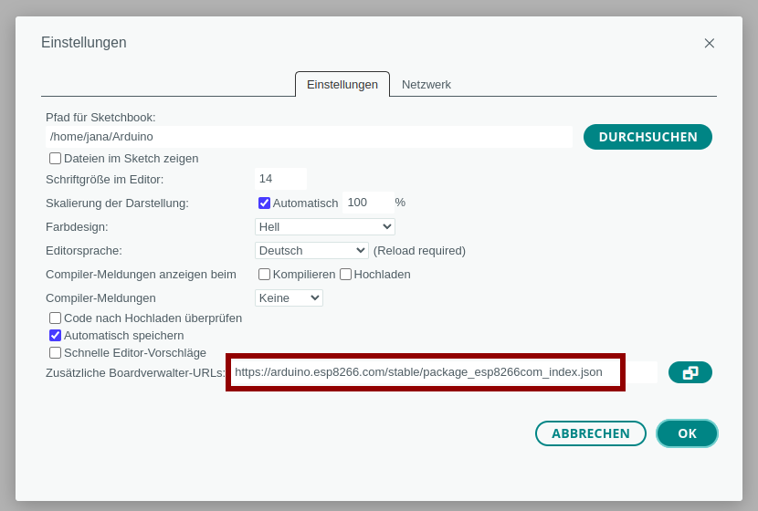
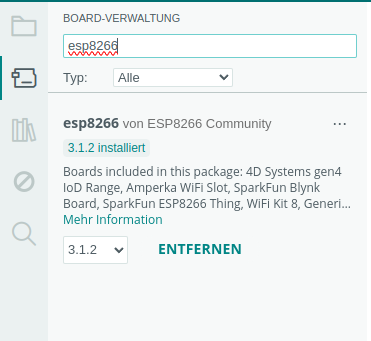
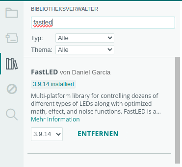
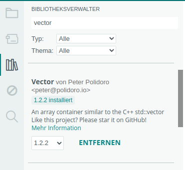
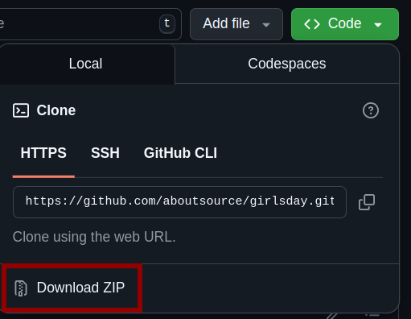

# Arduino

## Programm installieren

Arduino IDE über Store oder Console installieren

## Mikrocontroller hinzufügen

In der Arduino IDE unter `Datei` -> `Einstellungen` bei "Zusätzliche Boardverwalter-URLs" hinzufügen:

    https://arduino.esp8266.com/stable/package_esp8266com_index.json

Unter `Werkzeuge` -> `Board` -> `Board-Verwaltung`

    esp8266

suchen und installieren

Unter `Werkzeuge` -> `Board` -> `esp8266`

    LOLIN(WEMOS) D1 mini Lite

auswählen

Gegebenenfalls unter `Werkzeuge` -> `Port` den richtigen auswählen

## Bibliotheken hinzufügen

In der Arduino IDE unter `Werkzeuge` -> `Bibliotheken verwalten`

    FastLED

und

    Vector

jeweils suchen und installieren

# Beispiele

## Beispiele herunterladen

Oben auf den grünen Button `Code` und dann auf `Download ZIP` klicken

Den ZIP-Ordner könnt ihr auf eurem Computer vom Ordner `Downloads` in den Ordner `Arduino` verschieben und dort entpacken (rechte Maustaste und `enpacken` auswählen)

