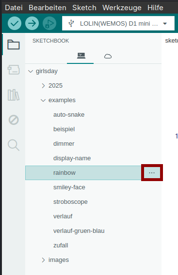

# Arduino

## Programm installieren

`Arduino IDE` bei über App-Store (Windows und Mac) oder Terminal (Linux) installieren

## LED Panel anschließen

Das USB-Kabel am Mikrocontroller, der am LED Panel hängt, einstecken und die andere Seite am Computer anschließen.
Da jetzt Strom fließt, müsste das zuletzt draufgeladene Programm starten, die LEDs also leuchten.

## Mikrocontroller hinzufügen

In der Arduino IDE unter `Datei` -> `Einstellungen` bei "Zusätzliche Boardverwalter-URLs" hinzufügen:

    https://arduino.esp8266.com/stable/package_esp8266com_index.json

Unter `Werkzeuge` -> `Board` -> `Board-Verwaltung`

    esp8266

suchen und installieren

Unter `Werkzeuge` -> `Board` -> `esp8266`

    LOLIN(WEMOS) D1 mini Lite

auswählen

Gegebenenfalls unter `Werkzeuge` -> `Port` den richtigen auswählen

## Bibliotheken hinzufügen

In der Arduino IDE unter `Werkzeuge` -> `Bibliotheken verwalten`

    FastLED

und

    Vector

jeweils suchen und installieren

# GirlsDay Projekte und Beispiele

hier findet ihr alle Programme, die ihr während des GirlsDays entwickelt habt, die Bespiele, die wir euch gezeigt haben, sowie ein paar weitere Beispiele.

## herunterladen

Oben auf den grünen Button `Code` und dann auf `Download ZIP` klicken

Den ZIP-Ordner könnt ihr auf eurem Computer vom Ordner `Downloads` in den Ordner `Arduino` verschieben und dort entpacken (mit rechter Maustaste auf den ZIP-Ordner klicken und `enpacken` auswählen)

## Sketch öffnen

Ein Sketch ist die Datei mit dem Programm, das auf den Mikrocontroller geladen werden kann.

Ihr könnt ein Sketch über das Sketchbook im linken Menü öffnen, indem ihr dort auf die drei Punkte neben dem Namen klickt.

Dort dann `Sketch in neuem Fenster öffnen` auswählen

Sollte es das Sketchbook in diesem Menü noch nicht geben, könnt ihr es über das Datei-Menü suchen.  
Dafür oben links auf `Datei` klicken, dann auf `Öffnen...` und in den Ordnern auf dem Computer den richtigen suchen und die Datei öffnen.

## Code auf den Mikrocontroller übertragen

Oben links af den Pfeil klicken, dann wird der Code auf den Mikrocontroller übertragen und das Programm aus dem Sketch sollte laufen.

# Links

Falls ihr weiter Interesse am Programmieren habt, könnt ihr euch mal die folgenden Angebote ansehen (externe Links):

[Programmieren mit der Maus](https://programmieren.wdrmaus.de/)  
Hier gibt es Lernspiele mit der Maus, um Programmieren in der Programmiersprache Scratch zu lernen. Scratch eigenet sich gut für Anfänger:innen, da dort mit Blöcken gearbeitet wird, statt alles selbst schreiben zu müssen.

[YouCodeGirls](https://youcodegirls.de/portal/)  
Hier gibt es viele Tutorials und Kurse (online) für verschiedene Altersstufen mit und ohne Vorkenntnisse

[von Hacker\*in zu Hacker\*in](https://eigenbaukombinat.de/vhzh25-termine/)  
Beim Eigenbaukombinat in Halle gibt es momentan eine tolle Workshop-Reihe, die sich an Mädchen und Queers vom 10 bis 18 Jahren richtet. Das Eigenbaukombinat befindet sich in der Nähe des Bahnhofs in Halle und ist somit von Leipzig gut zu erreichen. Dort findet auch einmal im Monat der [Junghackertag](https://junghacker.de/) (für alle Geschlechter) statt
